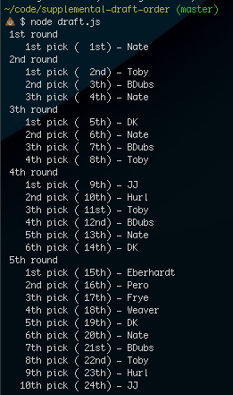

#supplemental-draft-order
An easy way to build out the snake draft order for the supplemental draft based on keepers and last year's standings

[]

## To use
1. `npm install`
2. Set the keepers and standings accordingly in config.json
3. `node draft`
4. View console output as well as order.txt and order.json

## Mocks
* You may edit the teams.json file and run `node mock-config-generator` to generate a random config.XXXXXX.json. It will need to be renamed to config.json before running the app
* Made edits to your config and want to sort them all by last year's standing? `node sort`